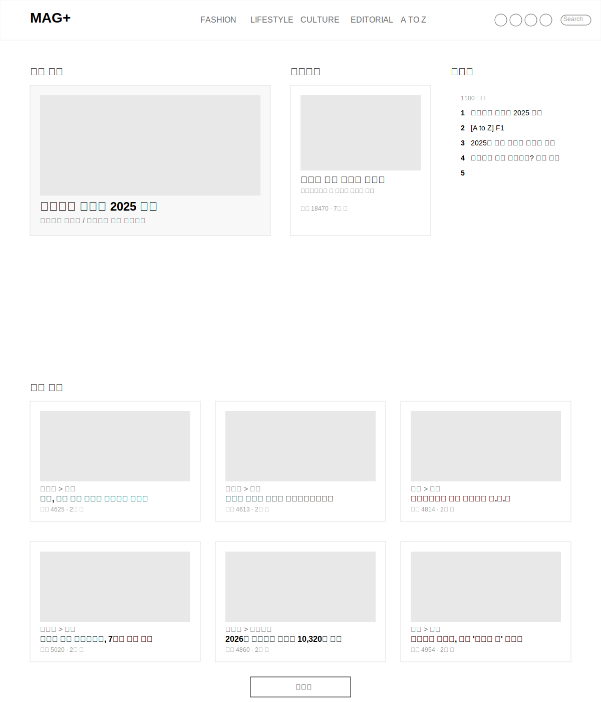
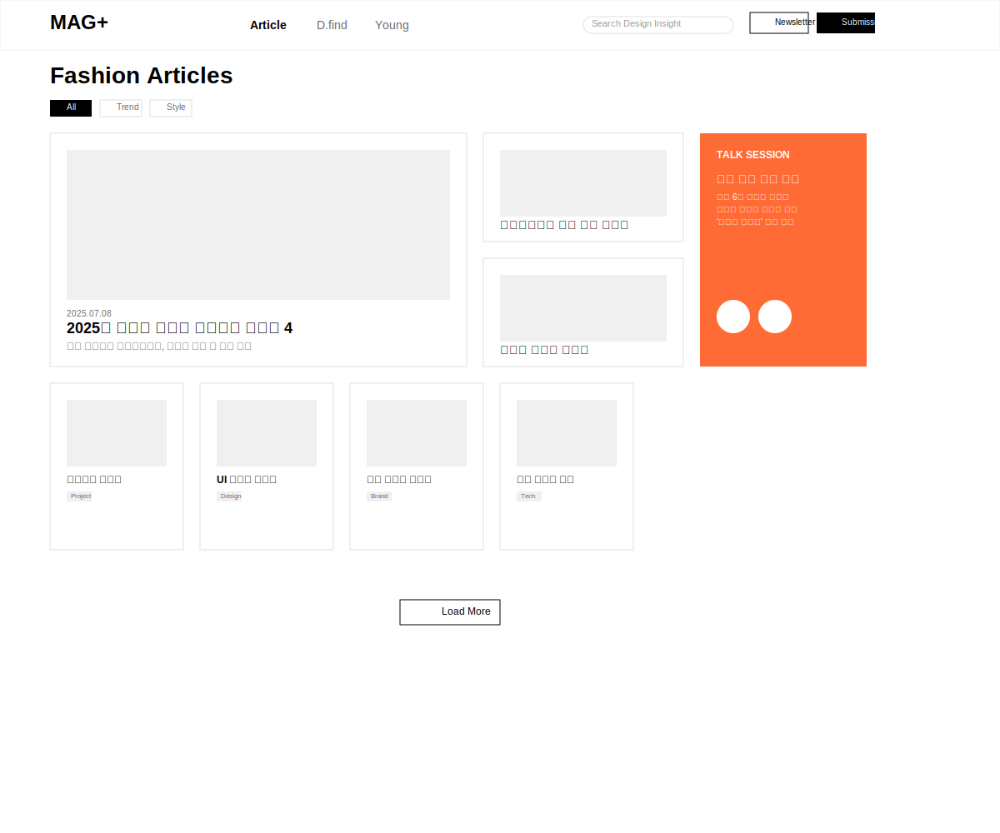

# MAG+ 웹매거진 UX 와이어프레임

## 개요

MAG+ 웹매거진의 UX 와이어프레임은 eyesmag, Design+ 등 최신 웹매거진 트렌드를 반영하여 **미니멀하고 힙한 디자인**으로 설계되었습니다. 깔끔한 화이트 스페이스, 세련된 타이포그래피, 그리고 직관적인 사용자 경험을 중심으로 구성되었습니다.

## 디자인 원칙

### 1. 미니멀리즘

- 불필요한 요소 제거
- 충분한 화이트 스페이스 활용
- 깔끔한 레이아웃과 일관된 간격

### 2. 힙한 느낌

- 모던한 sans-serif 타이포그래피
- 세련된 흑백 베이스 색상 팔레트
- 포인트 컬러의 절제된 사용

### 3. 사용자 중심 설계

- 직관적인 네비게이션
- 시각적 계층 구조
- 반응형 그리드 시스템

## 페이지별 와이어프레임

### 1. 홈페이지 (Home Page)

#### 주요 특징:

- **헤더**: 좌측 MAG+ 로고, 중앙 네비게이션 (FASHION, LIFESTYLE, CULTURE, EDITORIAL, A TO Z), 우측 소셜 아이콘과 검색
- **메인 섹션**: 3개 영역으로 구분
  - 인기 기사 (좌측 대형 피처 아티클)
  - 에디터픽 (중앙 추천 콘텐츠)
  - 급상승 (우측 랭킹 리스트)
- **최신 기사**: 3x2 그리드 카드 레이아웃
- **미니멀한 디자인**: 깔끔한 경계선과 충분한 여백

#### 사용자 경험:

- 한눈에 들어오는 주요 콘텐츠
- 카테고리별 쉬운 탐색
- 트렌딩 콘텐츠 즉시 확인 가능

### 2. 아티클 목록 페이지 (Article List)

#### 주요 특징:

- **헤더**: Design+ 스타일의 깔끔한 네비게이션
- **필터링**: 카테고리별 태그 필터 (All, Trend, Style, Brand)
- **레이아웃**:
  - 좌측 대형 피처 아티클
  - 우측 중형 사이드 아티클 2개
  - 하단 4x2 그리드 카드
- **사이드바**: 고정된 TALK SESSION 배너
- **태그 시스템**: 각 아티클별 카테고리 태그

#### 사용자 경험:

- 다양한 크기의 카드로 시각적 흥미 유발
- 필터링을 통한 효율적인 콘텐츠 탐색
- 무한 스크롤 또는 Load More 방식

### 3. 아티클 상세 페이지 (Article Detail)

#### 주요 특징:

- **헤더**: 일관된 네비게이션 유지
- **아티클 메타**: 날짜, 제목, 부제목, 카테고리 태그
- **소셜 공유**: 미니멀한 공유 아이콘
- **본문**: 대형 히어로 이미지와 깔끔한 텍스트 레이아웃
- **사이드바**:
  - "In This Article" 목차
  - 소셜 공유 버튼
  - 관련 아티클 추천
- **댓글**: 간단한 댓글 시스템

#### 사용자 경험:

- 읽기 편한 타이포그래피
- 구조화된 콘텐츠 탐색
- 관련 콘텐츠 쉬운 발견

## 기술적 고려사항

### 1. 반응형 디자인

- 데스크톱 우선 설계 (1200px 기준)
- 태블릿 및 모바일 적응형 레이아웃
- 유연한 그리드 시스템

### 2. 성능 최적화

- 이미지 지연 로딩
- 무한 스크롤 구현
- 빠른 페이지 전환

### 3. 접근성

- WCAG 2.2 AA 준수
- 키보드 네비게이션 지원
- 스크린 리더 호환성

## 색상 팔레트

### 주요 색상:

- **배경**: #ffffff (화이트)
- **텍스트**: #000000 (블랙)
- **보조 텍스트**: #666666 (다크 그레이)
- **경계선**: #e0e0e0 (라이트 그레이)
- **포인트**: #f0f0f0 (매우 연한 그레이)
- **액센트**: #ff6b35 (오렌지, 배너용)

### 타이포그래피:

- **폰트**: Arial, sans-serif
- **제목**: 24px-36px, font-weight: bold
- **본문**: 14px-16px, line-height: 1.5
- **캡션**: 12px, color: #666666

## 구현 가이드라인

### 1. 레이아웃

- CSS Grid 및 Flexbox 활용
- 일관된 간격 시스템 (20px, 40px, 60px)
- 카드 기반 컴포넌트 설계

### 2. 인터랙션

- 호버 효과 최소화
- 부드러운 전환 애니메이션
- 직관적인 피드백

### 3. 콘텐츠 관리

- 동적 콘텐츠 로딩
- 이미지 최적화
- SEO 친화적 구조

이 와이어프레임은 현대적이고 세련된 웹매거진 경험을 제공하며, 사용자가 콘텐츠에 집중할 수 있도록 설계되었습니다.
